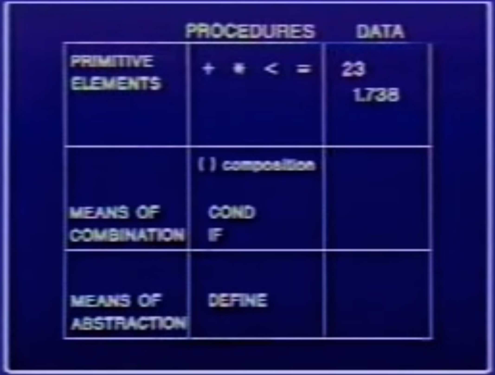

# SCIP with MIT OpenCourseWare

## [Lecture 1A](https://www.youtube.com/watch?time_continue=2&v=2Op3QLzMgSY)

# 3 BIG TOPIC

- **Black-Box Abstraction**
- **Conventional Interfaces**
- **Metalinguistic Abstraction** - making new languages
<hr>

- Computer science is a terrible name. First, it's not a science. And it's also not about computers. It's not a science. **It might be engineering or it might be art**.
- What's a process? A process is like a magical spirit that lives in the computer and does something. What directs **a process is a pattern of rules called a procedure**. Procedures are the spells. The programming language is the language for casting the spells.
- Computer science is the business is in formalizing the "how to" imperative knowledge.
- As opposed to the constraints in other kinds of engineering, where the constraints of what you can build are the constraints of physical systems, the constraints imposed in building large software systems are the limitations of our own minds.
- **BLACK-BOX Abstraction**. Engineering technique whereby a "black box" can be used without knowing its implementation details. And these "black boxes" can be combined to create even more complex systems.

```
  IMPERATIVE KNOWLEDGE "HOW TO"
  TO FIND AN APPROXIMATION TO √X

  - MAKE A GUESS G
  - IMPROVE THE GUESS BY AVERAGING G AND X/G
  - KEEP IMPROVING THE GUESS UNTIL IT IS GOOD ENOUGH

```
```
  METHOD FOR FINDING A FIXED POINT OF A FUNCTION F (THAT IS, A VALUE Y SUCH THAT F(Y) = Y)

  - START WITH A GUESS FOR Y
  - KEEP APPLYING F OVER AND OVER UNTIL THE RESULT DOESN'T CHANGE VERY MUCH.

  EXAMPLE
    TO COMPUTE √X, FIND A FIXED POINT OF THE FUNCTION Y -> AVERAGE OF Y AND X/Y
```

- We're not only building boxes that input and output numbers. We're building boxes that can compute methods. We can have procedures whose values is another procedure.
- Procedures are going to be our ways of talking about imperative knowledge.

<HR/>

## BLACK - BOX ABSTRACTION

```
- PRIMITIVE OBJECTS
   PRIMITIVE PROCEDURES
   PRIMITIVE DATA

- MEANS OF COMBINATION
   PROCEDURE COMPOSITION
   CONSTRUCTION OF COMPOUND DATA

- CAPTURING COMMON PATTERNS
   HIGH-ORDER PROCEDURES
   DATA AS PROCEDURES
```



## conventional interfaces:
```
- GENERIC OPERATIONS
- LARGE-SCALE STRUCTURE AND MODULARITY
- OBJECT-ORIENTED PROGRAMMING
- OPERATIONS ON AGGREGATES
```
   - agreed upon ways of plugging things together.
   - SICP describes conventional interfaces as a design principle for working with data structures. It is composed of a set of standard operators or combinators that connect the different steps required to implement computations in computer programs
   
## Metalinguistic Abstraction - making new languages
```
- INTERPRETATION APPLY-EVAL
- EXAMPLE - LOGIC PROGRAMMING
- REGISTER MACHINES
```

<hr>

- **primitive elements**
- **means of combination**: in Lisp combination which has meaning, applying operators to operands.
- **means of abstraction**

<hr>

##Lisp
```lisp
(DEFINE (SQUARE x) (* x x))
```
is same as

```lisp
(DEFINE SQUARE (LAMBDA (x) (* x x)))
``` 

- Lambda is Lisp's way of saying "make a procedure".
-  A key thing in Lisp is that you don't make arbitrary distinctions between things that happen to be primitive in the language and things that happen to be built in. So the things you construct get used with all the power and flexibility as if they were primitives.

```lisp
(DEFINE A (* 5 5))      
(DEFINE (D) (* 5 5))
```
- A --> 25
- D --> compound procedure D
- (D) --> 25
- (A) --> error

