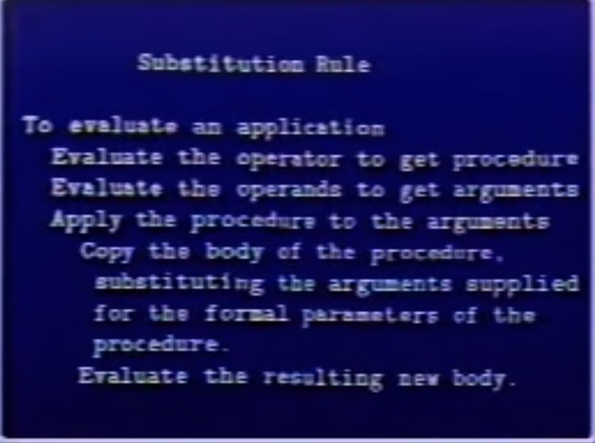
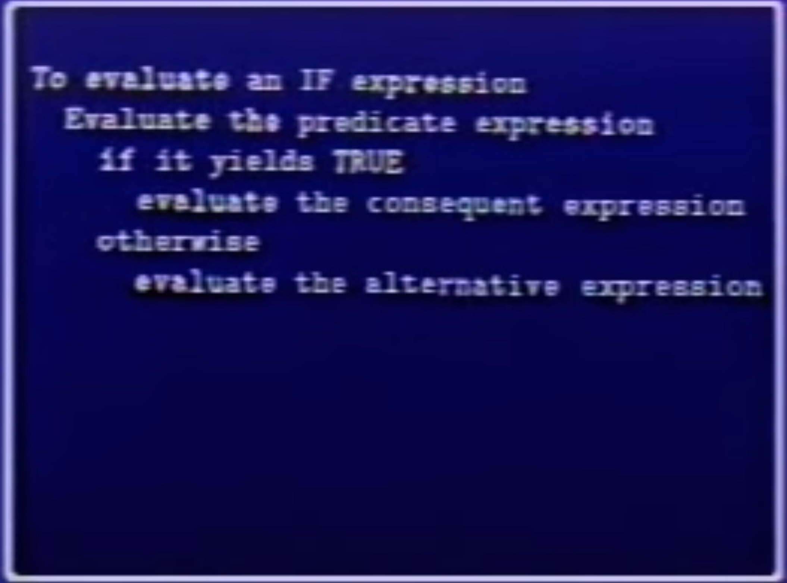

## [Lecture 2A](https://www.youtube.com/watch?v=dlbMuv-jix8)

```lisp
(define (sum-of-squares x y)
  (+ (square x) (square y)))

(define (square x)
  (* x x))
```

<hr>

### Kinds Of Expressions
- NUMBERS
- SYMBOLS
- LAMBDA-EXPRESSIONS
- DEFINITIONS
- CONDITIONALS
- COMBINATIONS



### One of the things we have to learn how to do is ignore details. The key to understanding complicated things is to know what not to look at and what not compute and what not to think.

<hr>



```lisp
(IF <predicate>
    <consequent>
    <alternative>)
```
<hr>


> 1.1
```lisp
(define (+ x y)
  (if (= x 0)
    y
    (+ (-1+ x) (1+ y))))
```
> 1.1 solution
```lisp
(+ 3 4)
(+ 2 5)
(+ 1 6)
(+ 0 7)
7
```
## Name of the above process is "Iteration"
- time = O(x)
- space = O(1)

> 1.2
```lisp
(define (+ x y)
  (if (= x 0)
    y
    (1+ (+ (-1+ x) y))))
```
> 1.2 solution
```lisp
(+ 3 4)
(1+ (+ 2 4))
(1+ (1+ (+ 1 4)))
(1+ (1+ (1+ (+ 0 4))))
(1+ (1+ (1+ 4)))
(1+ (1+ 5))
(1+ 6)
7
```

## Name of the above process is Linear "Recursion"
- time = O(x)
- space = O(x)

```lisp
(define (fib n)
  (if (< n 2)
    n
    (+ (fib (- n 1))
       (fib (- n 2)))))
```

```
                  fib4
             /          \
           fib3           fib2
      /         \         /   \
     fib2       fib1     fib1  fib0
   /    \         |       |    |
  fib1   fib0     1       1    0
  |      |
  1      0
```
- time = 0(fib(n))
- space = O(n)

```lisp
(define(MOVE N FROM TO SPIKE)
  (cond ((= N 0) 'done')
  (else
    MOVE (-1+ N) FROM SPIKE TO)
    (PRINT MOVE FROM TO)
    (MOVE (-1+ N) SPIKE TO FROM)))
```