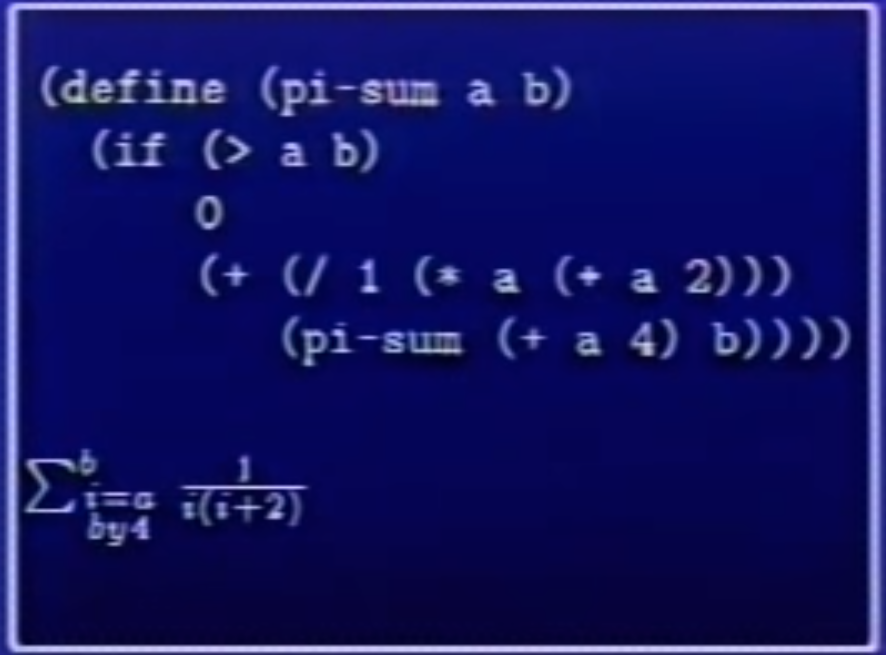
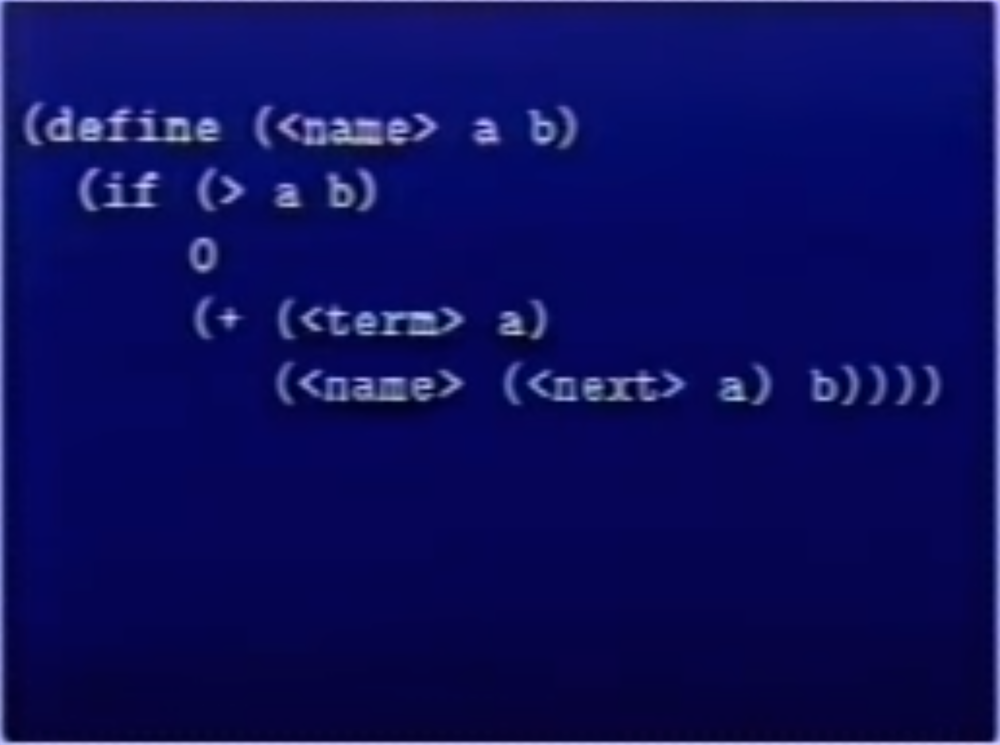
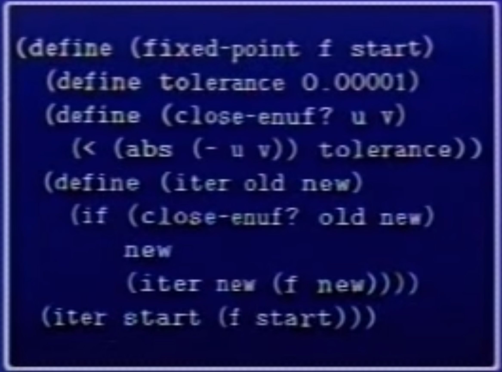

> **[1.2]Sum int from a to b**
```lisp
(define (sum-int a b) 
  (if (> a b)
    0
    (+ a 
    (sum-int (1+ a) b))))
``` 

> **[1.3] Sum square from a to b** 
```lisp
(define (sum-sq a b)
  (if (> a b)
    0
    (+ (sum-sq a)
      (sum-sq (1+ a) b))))
```

these programs are almost identical. the same predicate and the same consequent, and alternatives are very similar, too.
**Whenever trying to make complicated systems and understand them, it's crucial to divide the thins up into as many pieces as I can, each of which I understand separately.**


### *[1.4]Leibnitz's formula


## * General Pattern


```lisp
(define (SUM TERM A NEXT B)
  (IF (> A B)
    0
    (+ (TERM A)
      (SUM TERM 
        (NEXT A)
        NEXT
        B))))
```

<hr>

this procedure does exactly the same as [1.2]
```lisp
(define (SUM-INT) A B)
  (define (IDENTITY A) A)
  (SUM IDENTITY A 1+ B))
```

[1.3']
```lisp
(define (SUM-SQ A B)
  (SUM SQUARE A 1+ B))
```

[1.4']
```lisp
(define (PI_SUM A B)
  (SUM (lambda(i)(/ 1 (* i (+ i 2))))
    a
    (lambda(i)(+ i 4))
    b))
```
<hr>

## Higher-Order Procedures

**A fixed point** is a place which has the property that if you put it into the function, you get the same value out.



**Lambda** is very convenient for naming anonymous procedures. 

**Higher-Order Procedures** is that take procedural arguments and produce procedural values to help us clarify and abstract some otherwise complicated process.

```lisp
(define (SQRT X)
  (NEWTON (lambda(y)(- X (SQUARE y)))
  1))
```

```lisp
(define (NEWTON f guess)
  (define DF (DERIV F))
  (FIXED-POINT 
    (lambda(x)(- X (/ f x)(df x))))
    guess)
```

```lisp
(define DERIV
  (lambda (f)
    (lambda(x)
      (/ (- (f (+ x dx))
        (f x)
       dx))))
```
<hr>

