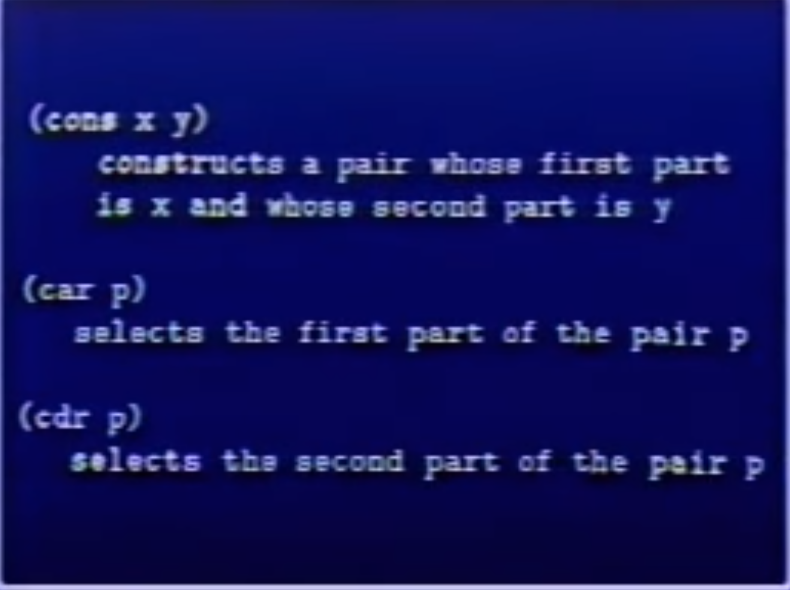
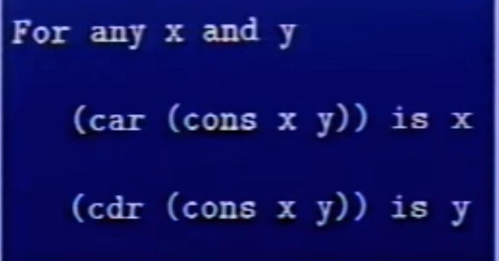
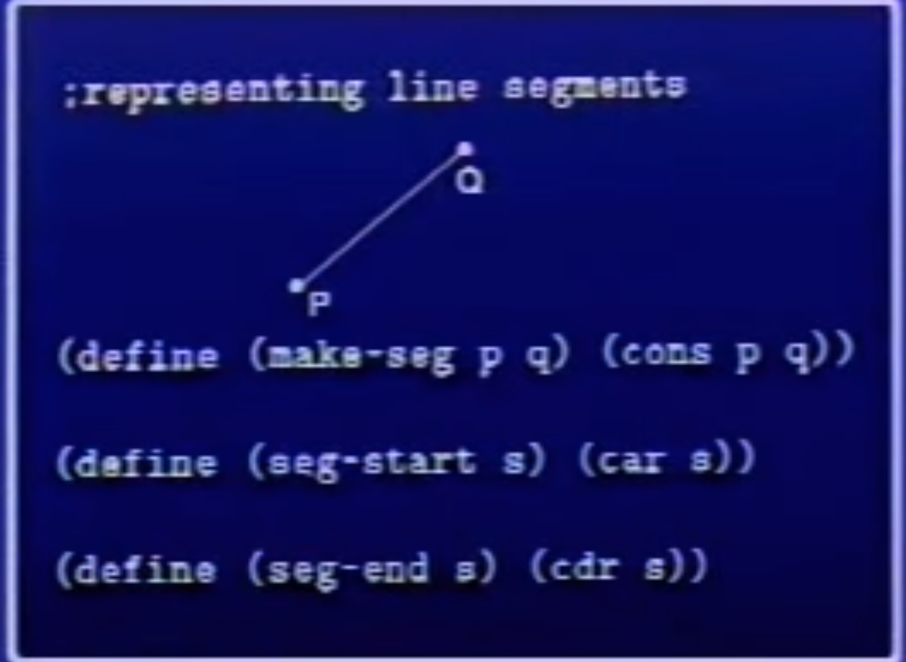
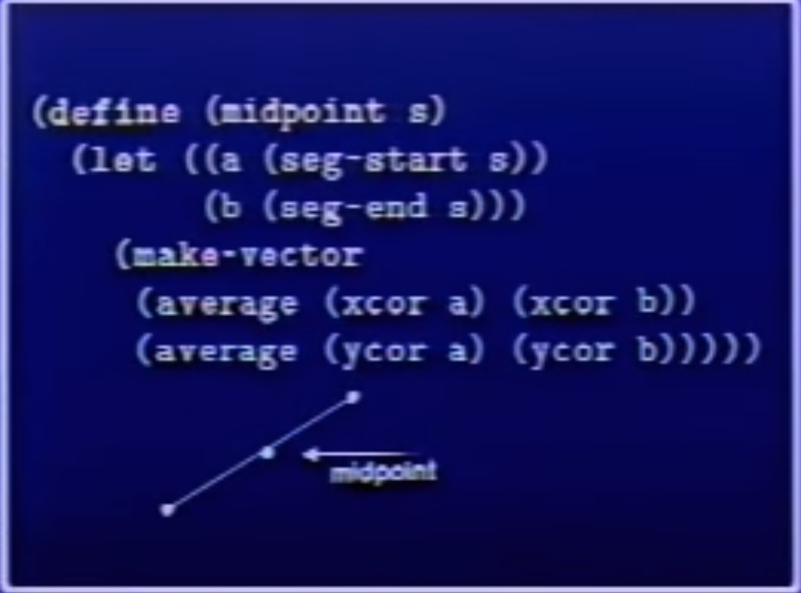
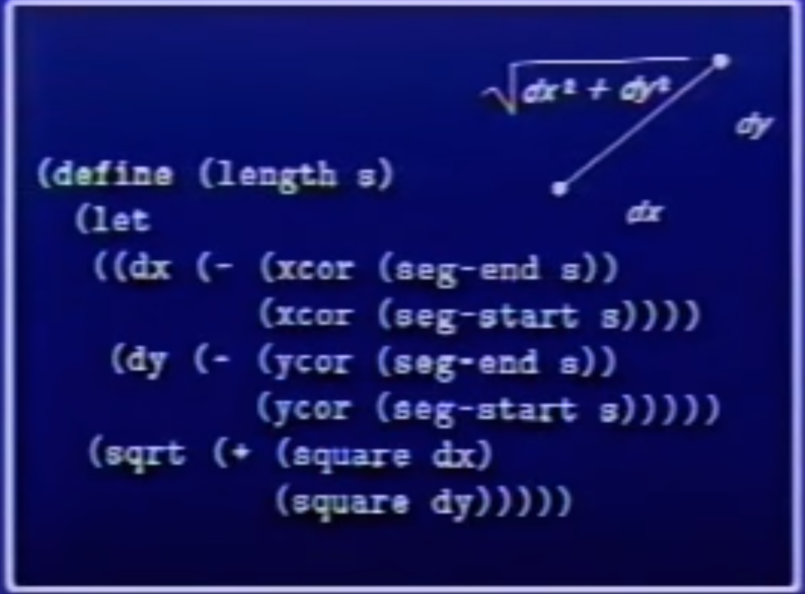

# Building Abstractions with Data

We also saw that higher-order procedures enhance the power of our language by enabling us to manipulate, and thereby to reason in terms of, general methods of computation. This is much of the essence of programming.

**Data abstraction** is sort of the programming methodology of setting up data objects by postulating constructors and selectors to isolate use from representation.

The general technique of isolating the parts of a program that deal with how data objects are represented from the parts of a program that deal with how data objects are used is a powerful design methodology called data abstraction. 

The use of the word “closure” here comes from abstract algebra, where a set of elements is said to be closed under an operation if applying the operation to elements in the set produces an element that is again an element of the set

 The Lisp community also (unfortunately) uses the word “closure” to describe a totally unrelated concept: **A closure is an implementation technique for representing procedures with free variables**. We do not use the word “closure” in this second sense in this book.

 # Compound Data : part4 - text section 2.1
