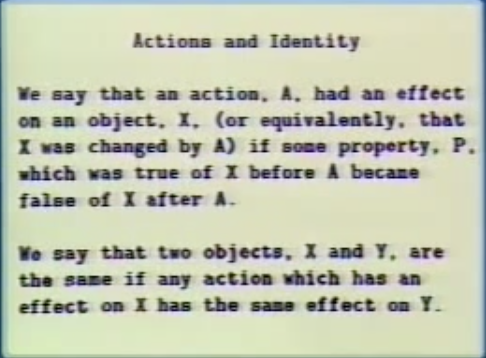

## The Environment Model

### Bound Variables

A variable `V` is **bound in an expresison** `E` if the meaning of `E` is **unchanged** by the uniform replacement of a variable `W`  not occurring in `E` for every occurence of `V` in `E`

    ∀x ∃y P(x, y)

In this example, x and y are bound variables: if they are changed to u and v, the meaning of the expression remains unchanged.

    (lambda (y) ((lambda (x) (* x y)) 3))

    <=>

    (lambda (y) ((lambda (z) (* z y)) 3))

### Free Variables

A variable `V` is **free in an expresison** `E` if the meaning of `E` is **changed** by the uniform replacement of a variable `W`  not occurring in `E` for every occurence of `V` in `E`

    (lambda (x) (* x y))

In this example the variable y is free (or unbound).

    (lambda (y) (lambda (x) (* x y)) 3))

In this expression the variable `*` is free.

### Scope

If `X` is a bound variable in `E` then there is a lambda expression where it is bound.  We call the list of formal parameters of the lambda expression the **"bound variable list"** and we sya that the lambda expression **"binds"** the variable **"declared"** in its bound variable list.  In addition, these parts of the expression where a variable has a value defined by the lambda expression which binds it is called the **"scope"** of the variable.

### Environments

An environment is a way to perform substitution virtually.  An environment is a function or a "table", it's made of frames (pieces of environment chained together).

A procedure is a composite object made of a (pointer to a) piece of code and a (pointer to an) environment.

    (define make-counter
      (lambda (n)
        (lambda()
          (set! n (1+ n))
          n)))

The `define` adds `make-counter` to the global environment.

    (define c1 (make-counter 0))

We evaluate make-counter in the global environment.  We construct a frame with a value for n = 0.  The lambda is linked to this frame.

    (define c2 (make-counter 10))

The new counter is linked to another frame with a value for n = 10.

We have created **computational objects** with their own **local state**.

By introducing **assignments** and **objects**, we have open a can of worms.

  